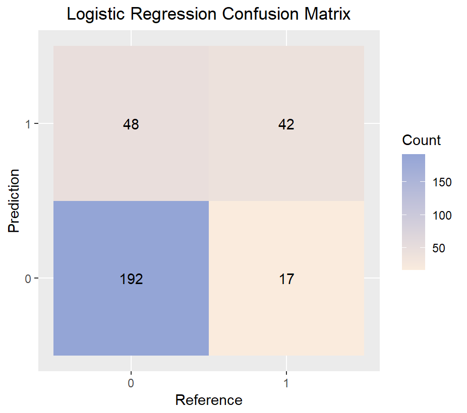

**Professor: M. Rosário Oliveira**

**Group Members:**

| Antonio Villas Bôas | Darlan Nascimento | Emma Dennis-Knieriem | Leonardo Aikawa | Tunahan Güneş |
|:-:|:-:|:-:|:-:|:-:|
| ist1105429 | ist1108076 | ist1105545 | ist1105545 | ist1108108 |

# Fitness Club Dataset for ML Classification


\newpage

## Introduction

Multivariate analysis is a pivotal statistical technique in the realm of data science, particularly when dealing with datasets encompassing multiple interrelated variables. It offers a sophisticated approach to understanding the nuanced relationships and patterns that emerge from complex data. This method is crucial for extracting meaningful insights from datasets where multiple factors interact in intricate ways, as is often the case in real-world scenarios.

Multivariate analysis includes a variety of techniques, each suited to different types of data and analysis objectives. Key methods such as logistic regression, decision trees, and cluster analysis are particularly relevant in scenarios where predicting outcomes or classifying data points are the main goals. These techniques allow for a comprehensive analysis, considering how various factors collectively influence outcomes [@appliedMultiVar2007].

## Description of the problem under study

Our dataset was select from [Kaggle](https://www.kaggle.com/datasets/ddosad/datacamps-data-science-associate-certification/data). The dataset provided for this analysis originates from GoalZone, a well-known fitness club chain in Canada. GoalZone operates several fitness classes, with capacities of either 25 or 15 participants. A significant challenge they face is the discrepancy between class bookings and actual attendance. While some classes are consistently fully booked, the actual attendance rate often falls short of expectations. This scenario presents both a logistical challenge and an opportunity for optimization.

The primary challenge is predicting whether a member who has booked a class will actually attend. Accurately forecasting attendance allows GoalZone to optimize class capacities effectively, ensuring maximum utilization of resources and enhanced member satisfaction. This challenge involves analyzing various factors that might influence attendance, such as the time of the class, member demographics, previous attendance patterns, and class type.

## Objectives

The analysis of the GoalZone dataset aims to achieve the following objectives:

Predictive Analysis: Develop a predictive model that can accurately forecast whether a member who has booked a class will attend. This involves identifying key variables that influence attendance and employing appropriate multivariate techniques.
Optimization of Class Capacities: Use the insights gained from the predictive model to optimize class capacities, enabling GoalZone to allocate spaces more effectively and potentially increase the total number of spaces offered.
Enhancing Member Experience: By improving the accuracy of attendance predictions, GoalZone can reduce overbooking and under-utilization issues, leading to a better overall experience for members.
Data-Driven Decision Making: Provide GoalZone with data-driven strategies to manage class schedules and capacities, thereby improving operational efficiency.

You can also embed plots, for example:

```{r setup, include=FALSE, echo=FALSE}
knitr::opts_chunk$set(echo = TRUE)
library(readr)
library(dplyr)
library(tidyr)
library(stringr)
```

```{r exploratory}
fitdata <- read_csv("fitness_class_2212.csv", show_col_types = FALSE)
# str(fitdata)
summary(fitdata)

sapply(fitdata, function(x) sum(is.na(x))) # check each column for NA values
```

## Data Exploration and Cleaning

We noticed that some columns are not in the ideal format to work with our classification models. The column `days_before` should be a discrete (integer) number of days before the class the member registered, but in `fitdata` we got `class(fitdata$days_before)` as `r class(fitdata$days_before)`. Here are the steps we used to convert to integer:

```{r}
unique(fitdata$days_before)

fitdata$days_before <- fitdata$days_before %>%
     strsplit(split = " ") %>% # split some strings that had more than the number of days
     sapply(function(x) x[1]) %>% # gets the 1st element of the split strings
     as.integer() # converts to integer

class(fitdata$days_before)
```

For `day_of_week`, we needed to standardize to uniquely 7 values corresponding to the days of the week.
```{r}
unique(fitdata$day_of_week)

fitdata$day_of_week <- fitdata$day_of_week %>%
     tolower() %>% # converts to lower case
     substr(1, 3) %>% # gets only the 3 first elements of each string
     factor() # Converts to factor to be used as categorical variable

table(fitdata$day_of_week)
```

`fitdata$time` is a ordinal variable which indicates if the booked fitness class is in the morning (AM) or afternoon (PM). This is also categorical so we encoded it to numerical representation ("AM" / "PM" to 0 / 1).

```{r}
table(fitdata$time)

fitdata$time <- ifelse(fitdata$time == "AM", 0, 1) %>%
     factor()

table(fitdata$time)
```

`fitdata$category` correspond to the category of the fitness class. In this dataset only 6 categories are present and one of them is "-".

```{r}
table(fitdata$category)

fitdata <- fitdata %>%
     mutate(category = na_if(category, "-")) # Replace "-" with NA

fitdata$category <- factor(fitdata$category)
table(fitdata$category)
```

Dealing with missing values is crucial in data analysis to ensure the integrity and validity of the results. Missing data can introduce bias, reduce the statistical power, and lead to invalid conclusions. By appropriately addressing these gaps, whether through imputation, removal, or analysis modifications, we can enhance the robustness of our findings and make more accurate inferences from the data. This process is essential for maintaining the quality and reliability of statistical analysis in any research or data-driven decision-making [@little2002statistical].

```{r}
get_na <- function(df) { # get indices of NA values in each column
     na_rows <- lapply(df, function(x) which(is.na(x))) %>%
          unlist() %>% unique() # get the unique indices of all columns
     return(na_rows)
}
na_rows <- get_na(fitdata)
na_ratio <- length(na_rows) / dim(fitdata)[1]

fitdata <- fitdata[-na_rows, ]
```

For `na_ratio` = `r na_ratio` the removal of missing values (NAs) is acceptable since their proportion is very small, as it minimally affects the dataset's overall integrity and distribution.

## Estimation and validation methods

### 1. K-means clustering

The K-means clustering algorithm, crucial in high-dimensional data analysis, is detailed in classics like John Hartigan's "Clustering Algorithms." This iterative, algorithmic method identifies centroids of pre-specified clusters in multi-dimensional spaces, a task challenging in higher dimensions. K-means partitions data into clusters, requiring an initial guess of cluster numbers. Adjusting this number in subsequent runs helps in fine-tuning the clustering outcome, essential for analyzing complex data structures. [@peng2016exploratory]

As an unsupervised learning algorithm, K-means does not work with a target variable (in our case, `fitdata$attended`), but it can segment data into clusters, which can then potentially be analyzed to infer patterns that might be relevant for prediction.

Two unsupervised learning techniques were used to compare the results: k-means clustering and agglomerative nesting (Hierarchical Clustering). Although is not directly correlated, we used 2 centroids to try to see if each model would classify the fitness club attendance into 0 or 1 and then compare with `fitdata$attended`.

The metric used to compare models was a simple proportion of matching attendance and cluster assignments given by:

$$
\frac{\sum(\text{fitdata.attended} == \text{prediction})}{\text{length}(\text{fitdataattended})}
$$

For the agglomerative nesting (agnes) we tried an algorithm that tested every combination of `metrics` and `methods` such:

```{r}
metrics <- c('euclidean', 'manhattan')
methods <- c('single', 'complete', 'average')
```

The best AgNes combination was: {metric: manhattan, method: complete}. And the accuracy results are shown below:

| Model   | Accuracy |
|---------|:--------:|
| K-means |     0.49488    |
| AgNes   |     0.72392    |

The image below shows plots of the actual fitness club attendance, the attendance prediction of the K-means models, and the attendance of the best AgNes model, respectively. For more details about the algorithm used to create the models and plots, please check the `kmeans.R` file.


According to the plots above, there doesn't appear to be a clear boundary separating the attended and not-attended groups in either plot, suggesting that these features alone may not strongly predict attendance.

### Splitting The Data
To train and test our supervised models, we applied a 80-20 split for our data. And, all the models we applied are then trained and tested on the same sets such that: 

```{r}
library(caret) 
library(rpart)

set.seed(42) #Setting the seed for reproducibility

# Specify the proportion of the test data
test_proportion <- 0.2

# Use createDataPartition to create indices for the training set randomly
train_indices <- createDataPartition(fitdata$attended,p = 1 - test_proportion, list = FALSE)

#Creating Stratified Training And Test Datasets
train_data <- fitdata[train_indices, ]
test_data <- fitdata[-train_indices, ]
```

### 2. Logistic Regression
Logistic regression is a statistical model used for predicting the probability of a binary outcome based on one or more predictor variables. Unlike linear regression, which predicts a continuous outcome, logistic regression is used when the dependent variable is categorical and specifically binary, meaning it has only two possible outcomes (like yes/no, true/false, 1/0). The model estimates the probability that a given input point belongs to a certain class. The output of logistic regression is a probability score (between 0 and 1), and it employs a logistic function, often called the sigmoid function, to model the data. This function has an 'S'-shaped curve that can take any real-valued number and map it into a value between 0 and 1, making it useful for models where the output is a probability.

Applying logistic regression to this dataset is appropriate because the target variable, 'attended', is binary, indicating whether a fitness club member attended a class (1) or not (0). This fits perfectly with the nature of logistic regression, which is designed to handle binary outcome variables. Additionally, the dataset contains a mix of continuous, discrete, and categorical variables (like weight, days_before, day_of_week, time, etc.), which logistic regression can effectively incorporate to predict the probability of attendance. The model can thus help in understanding the relationship between these features and the likelihood of a member attending a class, providing valuable insights that could be used for decision-making or strategy development in the context of the fitness club. For instance, it can identify patterns or key factors influencing attendance, aiding in resource planning, personalized member engagement, or targeted marketing strategies.
```{r}
model <- glm(attended ~ ., fitdata = train_data, family = "binomial")
```

<!--  -->
```{r fig.align='center', out.width='65%', echo=FALSE}

```
| Data                    | Accuracy | F-1 Score |
|-------------------------|----------|:---------:|
| Logistical Regression   | 0.7826   | 0.8552339 |

### 3. Decision Tree
The Decision Tree is a supervised classification model known for its simplicity and interpretability. It handles categorical variables well and is not affected much by irrelevant features. However, it can overfit and is sensitive to training data variability. For our categorical-heavy data, a decision tree could be advantageous. To avoid overfitting, we can limit tree growth by setting constraints or prune the tree after full growth, though care must be taken to prevent underfitting with too much restriction.

In this project, both of the approaches are applied and tested with a large number of different parameters. At their best settings of both approaches by looking at the test data performance, the resulting trees were identical. Therefore, we kept the model with the first approach with minsplit=20, and minbucket=7 for simplicity: 

```{r}
dt_model <- rpart(attended ~ ., data = train_data, method = "class", minsplit=20, minbucket=7)
```

<!--  -->

```{r fig.align='center', out.width='65%', echo=FALSE}

```

As it can be seen by the tree our target variable is too dependent on the "months_before" and "weight" features. So that, majority of our data can be classified by just splitting the "months_before" feature.

The following results and confusion matrices are gathered by this tree:

<!--  -->
```{r fig.align='center', out.width='70%', echo=FALSE}

```
| Data    | Accuracy |Balanced Accuracy | F-1 Score |
|---------|:--------:|:----------------:|:---------:|
| Train   | 0.8007   |      0.7265      | 0.8647399 |
| Test    | 0.7747   |      0.6989      | 0.8465116 |

Although the accuracies are relatively better, having significantly lower balanced accuracies is worrisome. This means that the model is not effectively dealing the class imbalance. Even with experiements with different settings, and models such as SVMs, Neural Networks we were not able to get significantly better results. Therefore, we can conclude that the classes in our data are not easily seperable, and in order to have better classification, it is required to have more features that can explain our classes better. 

## Discussion of the results and interpretation of the findings

## Conclusions

## References

